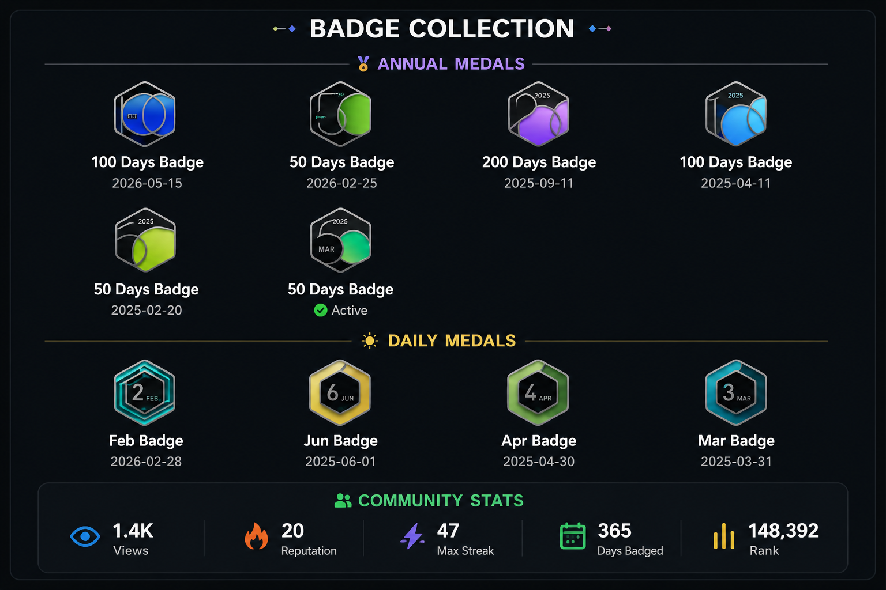

<h1 align="center">Leetcode Problems</h1>
<p>
  
</p>
# LeetCode Solutions

Welcome to my personal LeetCode solutions repository! This repo contains well-structured, clean, and optimized solutions to various algorithmic and data structures problems from LeetCode. 

It serves as a log of my coding practice, problem-solving journey, and a quick reference guide for interview preparation.

---

## Repository Highlights

* **Multi-Language Support:** Solutions are written across popular languages including **Java**, **Python**, **C++**, **JavaScript**, and **SQL**.
* **Categorized Solutions:** Includes a wide range of topics such as Dynamic Programming, Arrays, String Manipulation, Trees, Graphs, and Bit Manipulation.
* **Easy Navigation:** All problems are cleanly organized inside the `LeetCode-Problems-main` directory with descriptive filenames matching the official LeetCode problem titles.

---

## Directory Structure

```text
├── LeetCode-Problems-main/
│   ├── Spiral Matrix II/
│   ├── 2Sum.java
│   ├── 2Sum.py
│   ├── 2Sum.cpp
│   ├── 2Sum.js
│   ├── 4Sum.java
│   ├── Article Views.sql
│   └── ... (and many more)
└── README.md
